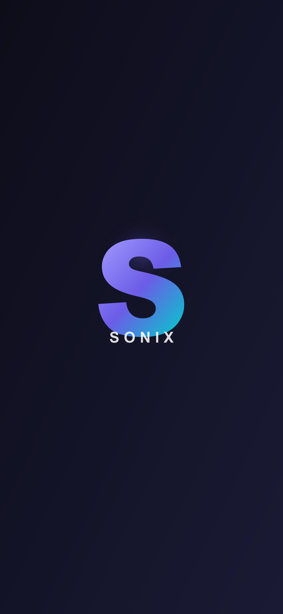

# Sonix — Full-Stack Social Media Platform

> Instagram-like social media app built with **Laravel 11** + **React Native (Expo 56)**. Stories, Posts, Real-time Messaging, Push Notifications, and more.



---

## Features

### Core
- **Authentication** — Email-based login/register with Laravel Sanctum tokens
- **User Profiles** — Avatar, bio, follower/following system, private accounts
- **Posts** — Photo/video posts with captions, hashtags, likes, comments, bookmarks, sharing
- **Stories** — Photos, videos, text-only stories with drawing overlay, stickers, reactions, highlights
- **Comments** — Nested comments with reply system

### Real-time
- **Messaging** — Full conversation system with WebSocket (Laravel Reverb + Redis)
- **Typing Indicators** — Remote typing animation
- **Online Status** — Redis-cached online/offline status
- **Push Notifications** — Expo push notification infrastructure

### Advanced
- **Video Background** — TikTok-style video on login/register screens
- **3D Design** — Floating tab bar, glassmorphism cards, animated screen transitions
- **i18n** — Arabic/English language switching (294+ translation keys)
- **Image Compression** — Server-side GD compression with thumbnails
- **Cursor-based Pagination** — Efficient message loading
- **Optimistic UI** — Instant message display with offline queue
- **Offline Mode** — Local message cache with AsyncStorage

---

## Tech Stack

| Layer | Technology |
|-------|-----------|
| Backend | Laravel 11, PHP 8.3+, PostgreSQL |
| Frontend | React Native (Expo 56), React 19 |
| Auth | Laravel Sanctum (token-based) |
| Real-time | Laravel Reverb (WebSocket), Redis |
| Database | PostgreSQL with 34 migrations |
| Image Processing | Native PHP GD |
| State Management | React Context API |
| Navigation | React Navigation 7 |

---

## Requirements

### Backend
- PHP 8.3+
- PostgreSQL 14+
- Redis 6+
- Composer

### Frontend
- Node.js 18+
- Expo CLI (`npm install -g expo-cli`)
- Expo Go app (for development) or EAS Build (for APK)

---

## Installation

### 1. Backend Setup

```bash
# Navigate to backend
cd laravel-backend

# Install dependencies
composer install

# Copy environment file
cp .env.example .env

# Generate application key
php artisan key:generate
```

**Configure `.env`:**

```env
DB_CONNECTION=pgsql
DB_HOST=127.0.0.1
DB_PORT=5432
DB_DATABASE=social_app
DB_USERNAME=your_db_user
DB_PASSWORD=your_db_password

CACHE_STORE=redis
REDIS_HOST=127.0.0.1
REDIS_PORT=6379

BROADCAST_CONNECTION=reverb
REVERB_APP_KEY=your-reverb-key
REVERB_APP_SECRET=your-reverb-secret
REVERB_APP_ID=your-reverb-app-id
```

```bash
# Run migrations
php artisan migrate --force

# Seed test user (optional)
php artisan db:seed

# Create storage symlink
php artisan storage:link

# Start the server
php artisan serve --port=5000
```

### 2. Frontend Setup

```bash
# Navigate to frontend
cd expo-app

# Install dependencies
npm install

# Configure API URL in src/api/client.js
# Change the API variable to your backend URL:
# const API = "http://YOUR_SERVER_IP:5000/api";

# Start development server
npx expo start
```

---

## Project Structure

```
social-platform/
├── laravel-backend/          # Laravel 11 API
│   ├── app/
│   │   ├── Http/Controllers/  # API controllers
│   │   ├── Models/            # Eloquent models
│   │   └── Services/          # ImageService (GD)
│   ├── config/
│   │   ├── broadcasting.php   # WebSocket config
│   │   └── reverb.php         # Reverb server config
│   ├── database/migrations/   # 34 migrations
│   └── routes/
│       ├── api.php            # API routes
│       └── channels.php       # WebSocket channels
│
├── expo-app/                  # React Native (Expo)
│   ├── src/
│   │   ├── api/               # Client, WebSocket, Cache, Notifications
│   │   ├── components/        # Theme, VideoBackground, StoryEditor, 3D/
│   │   ├── context/           # AuthContext, LanguageContext
│   │   ├── i18n/              # Arabic/English translations
│   │   ├── navigation/        # AppNavigator with 3D tab bar
│   │   └── screens/           # 20+ screens
│   └── assets/                # Icons, splash screen
│
└── start.bat                  # One-click server launcher (Windows)
```

---

## API Endpoints

| Method | Endpoint | Description |
|--------|----------|-------------|
| POST | `/api/auth/register` | Register new user |
| POST | `/api/auth/login` | Login |
| GET | `/api/feed` | Get feed posts |
| GET | `/api/stories` | Get stories |
| POST | `/api/posts` | Create post |
| POST | `/api/stories` | Create story |
| GET | `/api/messages/conversations` | List conversations |
| POST | `/api/messages` | Send message |
| GET | `/api/messages/conversation/{id}` | Get messages |
| POST | `/api/follow/{id}` | Follow user |
| POST | `/api/posts/{id}/like` | Like post |
| POST | `/api/posts/{id}/comment` | Comment on post |
| POST | `/api/stories/{id}/react` | React to story |

---

## Configuration

### Updating API URL

Edit `expo-app/src/api/client.js`:
```javascript
const API = "http://YOUR_SERVER_IP:5000/api";
```

### WebSocket URL

Edit `expo-app/src/api/websocket.js`:
```javascript
wsHost: "YOUR_SERVER_IP",
```

### Language Default

Edit `expo-app/src/context/LanguageContext.js`:
```javascript
const [lang, setLang] = useState("ar"); // "ar" for Arabic, "en" for English
```

---

## Deployment

### Backend (Railway / Render)

1. Push code to GitHub
2. Create account on [Railway](https://railway.app) or [Render](https://render.com)
3. Connect your GitHub repo
4. Set environment variables
5. Deploy

### Frontend (EAS Build)

```bash
# Install EAS CLI
npm install -g eas-cli

# Login to Expo
eas login

# Configure build
eas build:configure

# Build APK for Android
eas build --platform android --profile preview
```

---

## License

MIT License — You are free to use, modify, and distribute this software.

---

## Support

For questions or issues, refer to the documentation or open an issue on GitHub.
